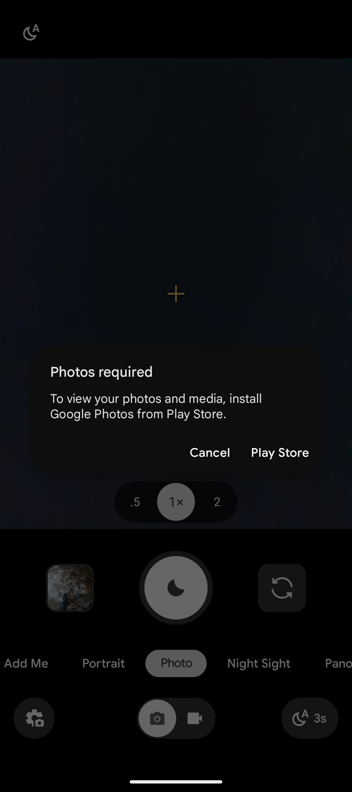

# Google Pixel Camera to Immich

With this app you can redirect the thumbnail of the [Google Pixel Camera](https://play.google.com/store/apps/details?id=com.google.android.GoogleCamera) to Immich.  
By default, the Camera requires you to have [Google Photos](https://play.google.com/store/apps/details?id=com.google.android.apps.photos) installed. It doesn't provide a way to view Images or Videos you took without it.

This app fixes this Problem. It spoofs being Google Images and hooks your preview request to open the Image you want to see in Immich.  
Here is how the Google Camera app looks without having Google Photos installed:



## Installation

You can download the APK file in the [GitHub Releases here](https://github.com/skyracer2012/google-pixel-camera-to-immich/releases/latest).

Keep in mind that you need to uninstall Google Photos before. This is because the package name of this app is `com.google.android.apps.photos`!

> **Warning:** On some devices, Google Photos is a system app. In this case, you cannot delete it meaning this app won't work there.

I tested this on [GrapheneOS](https://grapheneos.org/) version `2026081300` as of August 2026.
With Google Camera's version from 14th of August 2026

Requires Android 15+ (API 35) and [Immich v3](https://immich.app/).

## Building

The app is a simple gradlew android studio app. You can build it using

```bash
./gradlew assembleRelease
```

For release builds, set these environment variables: `KEYSTORE_FILE`, `KEYSTORE_PASSWORD`, `KEY_ALIAS`, `KEY_PASSWORD`.

## Verify APK

You can check that the APK using the SHA-256 of the keystore for the signing certificate:

```
48:D8:54:95:78:1B:81:73:55:8D:00:9D:66:B7:AC:04:A8:56:DF:15:A5:E2:73:55:71:C4:9C:73:A7:2D:EE:20
```

To check the certificate of the downloaded APK you can use `apksigner verify --print-certs GooglePixelCameraToImmich-v*.apk`

## Technical Details

<details>
<summary>Click to expand</summary>

Google Camera sends an `android.provider.action.REVIEW` intent with `image/*` or `video/*` to the `com.google.android.apps.photos` package.  
This app listens for this intent and builds an `ACTION_VIEW` intent targeted to `app.alextran.immich`. It passes the targeted image or video URI to Immich.  
To test this whilst developing, you can use the following ADB command (because Google Camera cannot be installed on x86 emulators)
```shell
adb shell am start \
  -a android.provider.action.REVIEW \
  -c android.intent.category.DEFAULT \
  -t image/jpeg \
  -d content://media/external/images/media/{CHANGEME}
```

</details>


## Sources

This app was inspired by [google-pixel-camera-redirect](https://github.com/nermolov/google-pixel-camera-redirect) by [@nermolov](https://github.com/nermolov) (MIT License).  
They implemented the core redirection logic, but it lacks the opening of the correct image in Immich, which this app provides. As far as I can see they also listen for the wrong intent and don't provide a pre-compiled APK.  
I used their example Image of the Error you get if you don't have Google Photos installed above.

After release of this project I found [Gcam-Services-Provider](https://github.com/lukaspieper/Gcam-Services-Provider/tree/main). They seem to offer the same functionality with your default gallery app as long as you use their "photosonly" variant.  
This Repository will however always open Immich, no matter your default app alongside Error Handling if something goes wrong.